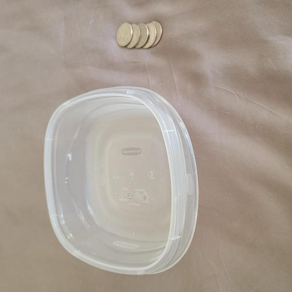

# Flip-A-Coin-To-Your-Container 

## Overview
This is a simple game called Flip-A-Coin-To-Your-Container. It can be played at home using just a few coins (preferably quarters, but any type of coin will work) and a medium sized container (tupperware or something similar) with at least a 5 x 5 inch opening with two inches of depth (See image below for example materials). The game can be played anywhere and in any room. The minimum amount of players that are required to play this game are one, that's right you can even play this game alone, but its always more fun with friends! The maximum amount of players is determined by the amount of coins available!

       
    <h3>Game Materials Needed</h3>

### How to play the game: 
1. Each player will start with five coins and three turns.
2. Each player will take a turn by flipping (as shown in the "Coin Flip Gif" below) all of their coins. 
3. The player whos turn it is will flip all of their coins one at a time, in an attempt to successfully flip the coin to STAY in the container.
4. Each successful coin flip will give that player 1 point. 
    i. If a coin hits the inside of the container but bounces out and lands elsewhere, it is considered a "miss" and does not count as a point.    
5. After a player completes their turn (no more coins in their hand to flip), they must pick up any "missed" coins that are not sitting in the container to be used for their next turn. 
6. If all players still have coins:
    i. Next players turn begins. Repeat steps 2 through 5.
7. If a player has FIVE points after every player has had the same amount of turns:
    i. That player wins!
8. If all players complete 3 turns and no player has FIVE points:
    i.The player with the most points wins.
    ii. If no one player has the most points, it is a tie game, and those players that are tied MUST have a rematch!

### Objectives
The Goal of the game is to get all of the coins in a players hand into the container in the least amount of turns. 
A good strategy to avoid the coins from bouncing back up from the container is to aim for the coin to land in front of the container and land inside on its second bounce. It is also highly suggested to play with the container up against a wall to limit chasing coins all over the place.

    
    <h3>Coin Flip Gif</h3>

## The Rules
1. The container must be placed a minimum of five feet away from the players.
    a. The container may be placed against a wall or be placed on open floor or desk.
2. Each player has to "flip" all the coins in their possesion to complete one turn.
    a. If a coin bounces off the ground or wall and still lands in the container, it counts!
3. Each successful landing of a coin in the container counts as one point towards that player.
4. After each players turn, they will pick up all the "missed" coins (not in the container) to be used for their next turn. 
5. Each player will get a maximum of three turns.
6. If after the three turns are completed by all players, the player with the points wins!
7. Rule #6 can be modified up to five turns for extended gameplay.
8. HAVE FUN!
  

    
    <h3>Link to YouTube video of gameplay</h3>

